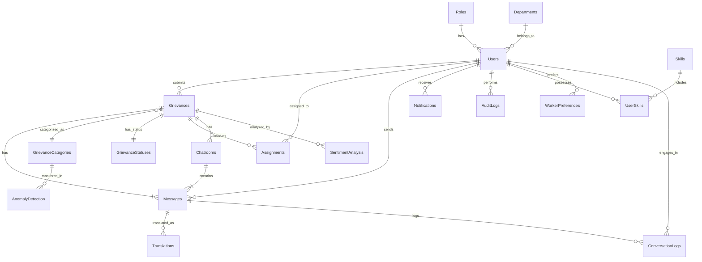

# Exhaustive Database Schema for Hostel Grievance Redressal System

Below is an exhaustive list of the database schema for the **Hostel Grievance Redressal System**, considering all entities and their respective properties as outlined in the provided `README.md` and `ai_plan.md`. The schema is designed to accommodate user management, grievance handling, AI/ML functionalities, real-time communication, multilingual support, and system administration.

## Table of Contents

1. [Users](#users)
2. [Roles](#roles)
3. [Departments](#departments)
4. [Skills](#skills)
5. [UserSkills](#userskills)
6. [WorkerPreferences](#workerpreferences)
7. [Grievances](#grievances)
8. [Grievance Categories](#grievance-categories)
9. [Grievance Statuses](#grievance-statuses)
10. [Assignments](#assignments)
11. [Chatrooms](#chatrooms)
12. [Messages](#messages)
13. [Sentiment Analysis](#sentiment-analysis)
14. [Anomaly Detection](#anomaly-detection)
15. [Translations](#translations)
16. [Conversation Logs](#conversation-logs)
17. [Notifications](#notifications)
18. [Audit Logs](#audit-logs)

---

## Users

Stores information about all users within the system, including residents, administrators, and staff.

| **Field**             | **Data Type**         | **Constraints**                          | **Description**                                   |
|-----------------------|-----------------------|------------------------------------------|---------------------------------------------------|
| `user_id`             | UUID                  | Primary Key, Default: UUID_GENERATE()    | Unique identifier for each user                   |
| `username`            | VARCHAR(50)           | Unique, Not Null                         | Username for login                                |
| `password_hash`       | VARCHAR(255)          | Not Null                                 | Hashed password for authentication                |
| `email`               | VARCHAR(100)          | Unique, Not Null                         | User's email address                              |
| `full_name`           | VARCHAR(100)          | Not Null                                 | User's full name                                  |
| `phone_number`        | VARCHAR(15)           | Nullable                                 | User's contact number                             |
| `role_id`             | UUID                  | Foreign Key → `Roles.role_id`, Not Null  | Role assigned to the user (e.g., Resident, Admin) |
| `department_id`      | UUID                  | Foreign Key → `Departments.department_id`| Department the user belongs to (if applicable)    |
| `language_preference` | VARCHAR(20)           | Default: 'English'                       | Preferred language for communication             |
| `created_at`          | TIMESTAMP             | Default: CURRENT_TIMESTAMP               | Timestamp of account creation                     |
| `updated_at`          | TIMESTAMP             | Default: CURRENT_TIMESTAMP, On Update: CURRENT_TIMESTAMP | Timestamp of last update          |
| `is_active`           | BOOLEAN               | Default: TRUE                            | Indicates if the user account is active           |

---
    
## Roles

Defines different user roles within the system.

| **Field**      | **Data Type** | **Constraints**                       | **Description**                     |
|----------------|---------------|---------------------------------------|-------------------------------------|
| `role_id`      | UUID          | Primary Key, Default: UUID_GENERATE() | Unique identifier for each role     |
| `role_name`    | VARCHAR(50)   | Unique, Not Null                      | Name of the role (e.g., Resident, Admin, Staff) |
| `description`  | TEXT          | Nullable                              | Description of the role             |

---

## Departments

Represents various departments within the hostel that handle grievances.

| **Field**          | **Data Type** | **Constraints**                       | **Description**                     |
|--------------------|---------------|---------------------------------------|-------------------------------------|
| `department_id`    | UUID          | Primary Key, Default: UUID_GENERATE() | Unique identifier for each department |
| `department_name`  | VARCHAR(100)  | Unique, Not Null                      | Name of the department (e.g., Maintenance, Electrical, Plumbing) |
| `description`      | TEXT          | Nullable                              | Description of the department       |
| `created_at`       | TIMESTAMP     | Default: CURRENT_TIMESTAMP            | Timestamp of department creation    |
| `updated_at`       | TIMESTAMP     | Default: CURRENT_TIMESTAMP, On Update: CURRENT_TIMESTAMP | Timestamp of last update          |

---

## Skills

Defines the various skills that staff members can possess, which are used for intelligent routing and job recommendations.

| **Field**      | **Data Type** | **Constraints**                           | **Description**                     |
|----------------|---------------|-------------------------------------------|-------------------------------------|
| `skill_id`     | UUID          | Primary Key, Default: UUID_GENERATE()     | Unique identifier for each skill    |
| `skill_name`   | VARCHAR(100)  | Unique, Not Null                          | Name of the skill (e.g., Plumbing, Electrical) |
| `description`  | TEXT          | Nullable                                  | Description of the skill            |
| `created_at`   | TIMESTAMP     | Default: CURRENT_TIMESTAMP                | Timestamp of record creation        |
| `updated_at`   | TIMESTAMP     | Default: CURRENT_TIMESTAMP, On Update: CURRENT_TIMESTAMP | Timestamp of last update          |

---

## UserSkills

Associates users with their respective skills. Each staff member can have multiple skills.

```sql:database/userskills.sql
-- userskills.sql
CREATE TABLE UserSkills (
    user_skill_id UUID PRIMARY KEY DEFAULT uuid_generate_v4(),
    user_id UUID NOT NULL REFERENCES Users(user_id) ON DELETE CASCADE,
    skill_id UUID NOT NULL REFERENCES Skills(skill_id) ON DELETE CASCADE,
    proficiency_level VARCHAR(50), -- e.g., Beginner, Intermediate, Expert
    created_at TIMESTAMP DEFAULT CURRENT_TIMESTAMP,
    updated_at TIMESTAMP DEFAULT CURRENT_TIMESTAMP
);
```

**Fields:**

| **Field**            | **Data Type** | **Constraints**                              | **Description**                                   |
|----------------------|---------------|----------------------------------------------|---------------------------------------------------|
| `user_skill_id`      | UUID          | Primary Key, Default: UUID_GENERATE()        | Unique identifier for each user-skill association |
| `user_id`            | UUID          | Foreign Key → `Users.user_id`, Not Null      | Identifier of the user                             |
| `skill_id`           | UUID          | Foreign Key → `Skills.skill_id`, Not Null    | Identifier of the skill                            |
| `proficiency_level`  | VARCHAR(50)   | Nullable                                      | Proficiency level in the skill (e.g., Beginner, Intermediate, Expert) |
| `created_at`         | TIMESTAMP     | Default: CURRENT_TIMESTAMP                   | Timestamp of record creation                      |
| `updated_at`         | TIMESTAMP     | Default: CURRENT_TIMESTAMP, On Update: CURRENT_TIMESTAMP | Timestamp of last update           |

---

## WorkerPreferences

Stores preferences and additional attributes for workers to enhance job recommendation and assignment processes.

```sql:database/worker_preferences.sql
-- worker_preferences.sql
CREATE TABLE WorkerPreferences (
    preference_id UUID PRIMARY KEY DEFAULT uuid_generate_v4(),
    user_id UUID NOT NULL REFERENCES Users(user_id) ON DELETE CASCADE,
    preferred_grievance_categories UUID[] REFERENCES GrievanceCategories(category_id),
    preferred_hostels UUID[] REFERENCES Departments(department_id),
    max_concurrent_assignments INTEGER DEFAULT 5,
    preferred_shift_times VARCHAR(100), -- e.g., "Morning", "Evening"
    job_type_preference VARCHAR(100), -- e.g., "Electrical", "Plumbing"
    created_at TIMESTAMP DEFAULT CURRENT_TIMESTAMP,
    updated_at TIMESTAMP DEFAULT CURRENT_TIMESTAMP
);
```

**Fields:**

| **Field**                  | **Data Type** | **Constraints**                                         | **Description**                                   |
|----------------------------|---------------|---------------------------------------------------------|---------------------------------------------------|
| `preference_id`            | UUID          | Primary Key, Default: UUID_GENERATE()                   | Unique identifier for each preference record      |
| `user_id`                  | UUID          | Foreign Key → `Users.user_id`, Not Null                 | Identifier of the worker                          |
| `preferred_grievance_categories` | UUID[]    | References `GrievanceCategories.category_id`           | Array of preferred grievance categories           |
| `preferred_hostels`        | UUID[]        | References `Departments.department_id`                  | Array of preferred hostels/departments            |
| `max_concurrent_assignments` | INTEGER     | Default: 5                                              | Maximum number of concurrent assignments a worker can handle |
| `preferred_shift_times`    | VARCHAR(100)  | Nullable                                                | Preferred shift times (e.g., "Morning", "Evening")|
| `job_type_preference`      | VARCHAR(100)  | Nullable                                                | Preferred job types (e.g., "Electrical", "Plumbing")|
| `created_at`               | TIMESTAMP     | Default: CURRENT_TIMESTAMP                             | Timestamp of record creation                      |
| `updated_at`               | TIMESTAMP     | Default: CURRENT_TIMESTAMP, On Update: CURRENT_TIMESTAMP | Timestamp of last update                   |

---

## Grievances

Stores all grievances submitted by residents.

| **Field**              | **Data Type** | **Constraints**                                           | **Description**                                             |
|------------------------|---------------|-----------------------------------------------------------|-------------------------------------------------------------|
| `grievance_id`         | UUID          | Primary Key, Default: UUID_GENERATE()                     | Unique identifier for each grievance                        |
| `user_id`              | UUID          | Foreign Key → `Users.user_id`, Not Null                   | Identifier of the resident who submitted the grievance      |
| `category_id`          | UUID          | Foreign Key → `GrievanceCategories.category_id`, Not Null | Category of the grievance                                   |
| `title`                | VARCHAR(255)  | Not Null                                                  | Brief title of the grievance                                |
| `description`          | TEXT          | Not Null                                                  | Detailed description of the grievance                      |
| `submission_timestamp` | TIMESTAMP     | Default: CURRENT_TIMESTAMP                                | Timestamp when the grievance was submitted                 |
| `urgency_level`        | VARCHAR(20)   | Not Null, Check: ('Low', 'Medium', 'High', 'Critical')    | Urgency level of the grievance                             |
| `status_id`            | UUID          | Foreign Key → `GrievanceStatuses.status_id`, Not Null     | Current status of the grievance                            |
| `voice_input_url`      | VARCHAR(255)  | Nullable                                                  | URL to the voice input file (if submitted via voice)       |
| `language_detected`    | VARCHAR(20)   | Default: 'English'                                        | Language of the submitted grievance                        |
| `created_at`           | TIMESTAMP     | Default: CURRENT_TIMESTAMP                                | Timestamp of grievance record creation                     |
| `updated_at`           | TIMESTAMP     | Default: CURRENT_TIMESTAMP, On Update: CURRENT_TIMESTAMP | Timestamp of last update                                   |

---

## Grievance Categories

Defines various categories under which grievances can be classified.

| **Field**             | **Data Type** | **Constraints**                       | **Description**                                 |
|-----------------------|---------------|---------------------------------------|-------------------------------------------------|
| `category_id`         | UUID          | Primary Key, Default: UUID_GENERATE() | Unique identifier for each category             |
| `category_name`       | VARCHAR(100)  | Unique, Not Null                      | Name of the grievance category (e.g., Maintenance, Electrical) |
| `description`         | TEXT          | Nullable                              | Description of the category                     |
| `created_at`          | TIMESTAMP     | Default: CURRENT_TIMESTAMP            | Timestamp of category creation                  |
| `updated_at`          | TIMESTAMP     | Default: CURRENT_TIMESTAMP, On Update: CURRENT_TIMESTAMP | Timestamp of last update                  |

---

## Grievance Statuses

Represents the various statuses a grievance can have throughout its lifecycle.

| **Field**          | **Data Type** | **Constraints**                       | **Description**                                 |
|--------------------|---------------|---------------------------------------|-------------------------------------------------|
| `status_id`        | UUID          | Primary Key, Default: UUID_GENERATE() | Unique identifier for each status               |
| `status_name`      | VARCHAR(50)   | Unique, Not Null                      | Name of the status (e.g., Submitted, In Progress, Resolved, Closed) |
| `description`      | TEXT          | Nullable                              | Description of the status                       |
| `created_at`       | TIMESTAMP     | Default: CURRENT_TIMESTAMP            | Timestamp of status creation                    |
| `updated_at`       | TIMESTAMP     | Default: CURRENT_TIMESTAMP, On Update: CURRENT_TIMESTAMP | Timestamp of last update                  |

---

## Assignments

Tracks the assignment of grievances to staff members.

```sql:database/assignments.sql
-- assignments.sql
CREATE TABLE Assignments (
    assignment_id UUID PRIMARY KEY DEFAULT uuid_generate_v4(),
    grievance_id UUID NOT NULL REFERENCES Grievances(grievance_id) ON DELETE CASCADE,
    staff_id UUID NOT NULL REFERENCES Users(user_id) ON DELETE SET NULL,
    assigned_at TIMESTAMP DEFAULT CURRENT_TIMESTAMP,
    expected_resolution_time VARCHAR(50),
    actual_resolution_time VARCHAR(50),
    status VARCHAR(50) DEFAULT 'Assigned', -- e.g., Assigned, In Progress, Completed
    created_at TIMESTAMP DEFAULT CURRENT_TIMESTAMP,
    updated_at TIMESTAMP DEFAULT CURRENT_TIMESTAMP
);
```

**Fields:**

| **Field**               | **Data Type** | **Constraints**                                           | **Description**                                              |
|-------------------------|---------------|-----------------------------------------------------------|--------------------------------------------------------------|
| `assignment_id`         | UUID          | Primary Key, Default: UUID_GENERATE()                     | Unique identifier for each assignment                        |
| `grievance_id`          | UUID          | Foreign Key → `Grievances.grievance_id`, Not Null         | Identifier of the assigned grievance                         |
| `staff_id`              | UUID          | Foreign Key → `Users.user_id`, Not Null                   | Identifier of the staff member assigned to the grievance     |
| `assigned_at`           | TIMESTAMP     | Default: CURRENT_TIMESTAMP                                | Timestamp when the grievance was assigned                     |
| `expected_resolution_time`| VARCHAR(50) | Nullable                                                  | Estimated time to resolve the grievance                       |
| `actual_resolution_time` | VARCHAR(50) | Nullable                                                  | Actual time taken to resolve the grievance                     |
| `status`                | VARCHAR(50)   | Default: 'Assigned'                                       | Current status of the assignment (e.g., Assigned, In Progress, Completed) |
| `created_at`            | TIMESTAMP     | Default: CURRENT_TIMESTAMP                                | Timestamp of assignment record creation                        |
| `updated_at`            | TIMESTAMP     | Default: CURRENT_TIMESTAMP, On Update: CURRENT_TIMESTAMP | Timestamp of last update                                       |

---

## Chatrooms

Represents dedicated chatrooms for each grievance to facilitate communication between residents and administrators/staff.

```sql:database/chatrooms.sql
-- chatrooms.sql
CREATE TABLE Chatrooms (
    chatroom_id UUID PRIMARY KEY DEFAULT uuid_generate_v4(),
    grievance_id UUID NOT NULL REFERENCES Grievances(grievance_id) ON DELETE CASCADE,
    created_at TIMESTAMP DEFAULT CURRENT_TIMESTAMP,
    updated_at TIMESTAMP DEFAULT CURRENT_TIMESTAMP
);
```

**Fields:**

| **Field**        | **Data Type** | **Constraints**                                       | **Description**                                   |
|------------------|---------------|-------------------------------------------------------|---------------------------------------------------|
| `chatroom_id`    | UUID          | Primary Key, Default: UUID_GENERATE()                 | Unique identifier for each chatroom               |
| `grievance_id`   | UUID          | Foreign Key → `Grievances.grievance_id`, Not Null     | Identifier of the associated grievance            |
| `created_at`     | TIMESTAMP     | Default: CURRENT_TIMESTAMP                            | Timestamp when the chatroom was created           |
| `updated_at`     | TIMESTAMP     | Default: CURRENT_TIMESTAMP, On Update: CURRENT_TIMESTAMP | Timestamp of last update                       |

---

## Messages

Stores all messages exchanged within chatrooms.

```sql:database/messages.sql
-- messages.sql
CREATE TABLE Messages (
    message_id UUID PRIMARY KEY DEFAULT uuid_generate_v4(),
    chatroom_id UUID NOT NULL REFERENCES Chatrooms(chatroom_id) ON DELETE CASCADE,
    sender_id UUID NOT NULL REFERENCES Users(user_id) ON DELETE SET NULL,
    message_content TEXT NOT NULL,
    translated_content TEXT,
    language VARCHAR(20) DEFAULT 'English',
    created_at TIMESTAMP DEFAULT CURRENT_TIMESTAMP,
    updated_at TIMESTAMP DEFAULT CURRENT_TIMESTAMP
);
```

**Fields:**

| **Field**           | **Data Type** | **Constraints**                                               | **Description**                                        |
|---------------------|---------------|---------------------------------------------------------------|--------------------------------------------------------|
| `message_id`        | UUID          | Primary Key, Default: UUID_GENERATE()                         | Unique identifier for each message                     |
| `chatroom_id`       | UUID          | Foreign Key → `Chatrooms.chatroom_id`, Not Null               | Identifier of the chatroom where the message was sent  |
| `sender_id`         | UUID          | Foreign Key → `Users.user_id`, Not Null                       | Identifier of the user who sent the message            |
| `message_content`   | TEXT          | Not Null                                                      | Original content of the message                        |
| `translated_content`| TEXT          | Nullable                                                      | Translated content of the message                      |
| `language`          | VARCHAR(20)   | Default: 'English'                                            | Language in which the message was sent                 |
| `created_at`        | TIMESTAMP     | Default: CURRENT_TIMESTAMP                                    | Timestamp when the message was sent                    |
| `updated_at`        | TIMESTAMP     | Default: CURRENT_TIMESTAMP, On Update: CURRENT_TIMESTAMP       | Timestamp of last update                                |

---

## Sentiment Analysis

Stores the results of sentiment and emotional analysis performed on grievances.

| **Field**               | **Data Type** | **Constraints**                                            | **Description**                                  |
|-------------------------|---------------|------------------------------------------------------------|--------------------------------------------------|
| `sentiment_id`          | UUID          | Primary Key, Default: UUID_GENERATE()                      | Unique identifier for each sentiment analysis     |
| `grievance_id`          | UUID          | Foreign Key → `Grievances.grievance_id`, Not Null          | Identifier of the associated grievance            |
| `sentiment_score`       | DECIMAL(5,2)  | Not Null                                                   | Overall sentiment score (e.g., -1.00 to 1.00)     |
| `emotion`               | VARCHAR(50)   | Not Null                                                   | Detected primary emotion (e.g., Anger, Frustration)|
| `confidence_score`      | DECIMAL(5,2)  | Not Null                                                   | Confidence level of the sentiment analysis        |
| `analyzed_at`           | TIMESTAMP     | Default: CURRENT_TIMESTAMP                                 | Timestamp when the analysis was performed          |
| `created_at`            | TIMESTAMP     | Default: CURRENT_TIMESTAMP                                 | Timestamp of record creation                       |
| `updated_at`            | TIMESTAMP     | Default: CURRENT_TIMESTAMP, On Update: CURRENT_TIMESTAMP    | Timestamp of last update                           |

---

## Anomaly Detection

Tracks anomalies detected in grievance patterns.

| **Field**            | **Data Type** | **Constraints**                                            | **Description**                                         |
|----------------------|---------------|------------------------------------------------------------|---------------------------------------------------------|
| `anomaly_id`         | UUID          | Primary Key, Default: UUID_GENERATE()                      | Unique identifier for each anomaly                      |
| `category_id`        | UUID          | Foreign Key → `GrievanceCategories.category_id`, Not Null   | Category in which the anomaly was detected              |
| `date`               | DATE          | Not Null                                                   | Date when the anomaly was detected                      |
| `grievance_count`    | INTEGER       | Not Null                                                   | Number of grievances detected on the specified date      |
| `expected_range_min` | INTEGER       | Not Null                                                   | Minimum expected number of grievances                    |
| `expected_range_max` | INTEGER       | Not Null                                                   | Maximum expected number of grievances                    |
| `description`        | TEXT          | Nullable                                                   | Description of the anomaly                               |
| `alert`              | BOOLEAN       | Default: FALSE                                             | Indicates if an alert was triggered                      |
| `created_at`         | TIMESTAMP     | Default: CURRENT_TIMESTAMP                                 | Timestamp of record creation                             |
| `updated_at`         | TIMESTAMP     | Default: CURRENT_TIMESTAMP, On Update: CURRENT_TIMESTAMP    | Timestamp of last update                                 |

---

## Translations

Stores translation logs for multilingual communication within chatrooms.

| **Field**           | **Data Type** | **Constraints**                                           | **Description**                                     |
|---------------------|---------------|-----------------------------------------------------------|-----------------------------------------------------|
| `translation_id`    | UUID          | Primary Key, Default: UUID_GENERATE()                     | Unique identifier for each translation log          |
| `message_id`        | UUID          | Foreign Key → `Messages.message_id`, Not Null              | Identifier of the original message                   |
| `source_language`   | VARCHAR(20)   | Not Null                                                   | Language of the original message                     |
| `target_language`   | VARCHAR(20)   | Not Null                                                   | Language into which the message was translated       |
| `translated_text`   | TEXT          | Not Null                                                   | Translated content of the message                    |
| `translation_confidence` | DECIMAL(5,2)| Not Null                                               | Confidence score of the translation                   |
| `translated_at`     | TIMESTAMP     | Default: CURRENT_TIMESTAMP                                | Timestamp when the translation was performed         |
| `created_at`        | TIMESTAMP     | Default: CURRENT_TIMESTAMP                                | Timestamp of record creation                          |
| `updated_at`        | TIMESTAMP     | Default: CURRENT_TIMESTAMP, On Update: CURRENT_TIMESTAMP   | Timestamp of last update                              |

---

## Conversation Logs

Stores logs of conversations handled by the context-aware chatbots for initial grievance handling.

```sql:database/conversation_logs.sql
-- conversation_logs.sql
CREATE TABLE ConversationLogs (
    conversation_id UUID PRIMARY KEY DEFAULT uuid_generate_v4(),
    user_id UUID NOT NULL REFERENCES Users(user_id) ON DELETE CASCADE,
    message_id UUID REFERENCES Messages(message_id) ON DELETE SET NULL,
    timestamp TIMESTAMP DEFAULT CURRENT_TIMESTAMP,
    intent VARCHAR(100),
    entities JSONB,
    bot_response TEXT,
    created_at TIMESTAMP DEFAULT CURRENT_TIMESTAMP,
    updated_at TIMESTAMP DEFAULT CURRENT_TIMESTAMP
);
```

**Fields:**

| **Field**     | **Data Type** | **Constraints**                                         | **Description**                                       |
|---------------|---------------|---------------------------------------------------------|-------------------------------------------------------|
| `conversation_id` | UUID      | Primary Key, Default: UUID_GENERATE()                   | Unique identifier for each conversation log           |
| `user_id`         | UUID      | Foreign Key → `Users.user_id`, Not Null                 | Identifier of the user involved in the conversation   |
| `message_id`      | UUID      | Foreign Key → `Messages.message_id`, Nullable            | Identifier of the message associated with the log     |
| `timestamp`       | TIMESTAMP | Default: CURRENT_TIMESTAMP                               | Timestamp of the message                               |
| `intent`          | VARCHAR(100)| Nullable                                                | Detected intent of the user's message                 |
| `entities`        | JSONB     | Nullable                                                | Extracted entities from the user's message            |
| `bot_response`    | TEXT      | Nullable                                                | Response generated by the chatbot                     |
| `created_at`      | TIMESTAMP | Default: CURRENT_TIMESTAMP                               | Timestamp of record creation                           |
| `updated_at`      | TIMESTAMP | Default: CURRENT_TIMESTAMP, On Update: CURRENT_TIMESTAMP | Timestamp of last update                             |

---

## Notifications

Manages notification settings and logs for users.

| **Field**            | **Data Type** | **Constraints**                                           | **Description**                                     |
|----------------------|---------------|-----------------------------------------------------------|-----------------------------------------------------|
| `notification_id`    | UUID          | Primary Key, Default: UUID_GENERATE()                     | Unique identifier for each notification               |
| `user_id`            | UUID          | Foreign Key → `Users.user_id`, Not Null                   | Identifier of the user receiving the notification     |
| `notification_type`  | VARCHAR(50)   | Not Null, Check: ('Email', 'SMS', 'In-App')               | Type of notification                                 |
| `content`            | TEXT          | Not Null                                                   | Content of the notification                          |
| `is_read`            | BOOLEAN       | Default: FALSE                                             | Indicates if the notification has been read           |
| `sent_at`            | TIMESTAMP     | Default: CURRENT_TIMESTAMP                                | Timestamp when the notification was sent             |
| `created_at`         | TIMESTAMP     | Default: CURRENT_TIMESTAMP                                | Timestamp of record creation                          |
| `updated_at`         | TIMESTAMP     | Default: CURRENT_TIMESTAMP, On Update: CURRENT_TIMESTAMP   | Timestamp of last update                              |

---

## Audit Logs

Tracks all significant actions and changes within the system for security and compliance.

| **Field**            | **Data Type** | **Constraints**                                           | **Description**                                     |
|----------------------|---------------|-----------------------------------------------------------|-----------------------------------------------------|
| `audit_id`           | UUID          | Primary Key, Default: UUID_GENERATE()                     | Unique identifier for each audit log entry           |
| `user_id`            | UUID          | Foreign Key → `Users.user_id`, Nullable                    | Identifier of the user who performed the action      |
| `action`             | VARCHAR(255)  | Not Null                                                   | Description of the action performed                  |
| `details`            | TEXT          | Nullable                                                   | Additional details about the action                   |
| `timestamp`          | TIMESTAMP     | Default: CURRENT_TIMESTAMP                                | Timestamp when the action was performed              |
| `ip_address`         | VARCHAR(45)   | Nullable                                                   | IP address from which the action was performed       |

---

## Entity-Relationship Diagram (ERD)

Below is a simplified representation of the relationships between the main entities:



---

## Additional Tables and Changes

To align the database schema with the detailed AI/ML implementation plans outlined in the `ai_plan.md`, the following additional tables and modifications have been incorporated:

### Skills

Defines the various skills that staff members can possess, which are used for intelligent routing and job recommendations.

### UserSkills

Associates users with their respective skills. Each staff member can have multiple skills.

### WorkerPreferences

Stores preferences and additional attributes for workers to enhance job recommendation and assignment processes.

### Conversation Logs

Stores logs of conversations handled by the context-aware chatbots for initial grievance handling.

---

## Additional Notes

- **Intelligent Routing and Workflow Automation:** The `Skills`, `UserSkills`, and `WorkerPreferences` tables facilitate the intelligent assignment of grievances to suitable staff members based on their skills, availability, and preferences.

- **Advanced Sentiment and Emotional Intelligence Analysis:** The `SentimentAnalysis` table captures nuanced emotional states from grievance descriptions, enabling empathetic responses.

- **Context-Aware Chatbots for Initial Grievance Handling:** The `ConversationLogs` table records interactions between users and chatbots, aiding in improving chatbot responses and handling user intents effectively.

- **Worker Job Recommendation:** The `WorkerPreferences` and related tables enhance the system's ability to recommend and assign jobs optimally, considering various factors like worker skills, preferences, and current workload.

- **Multilingual Translation in Chatroom:** The existing `Translations` table supports multilingual communication within chatrooms, ensuring clear and effective interactions between users and staff.

- **Anomaly Detection:** The `AnomalyDetection` table continues to monitor and log unusual patterns in grievances, aiding in proactive issue resolution.

- **Scalability and Future Enhancements:** The schema is designed to accommodate future AI/ML functionalities, ensuring scalability and flexibility for additional features such as predictive analytics and personalized user experiences.

---

# License

This schema design is part of the Hostel Grievance Redressal System project and is licensed under the [MIT License](LICENSE).

# Contact

For any questions or feedback regarding the database schema, please contact [your-email@example.com](mailto:your-email@example.com).
