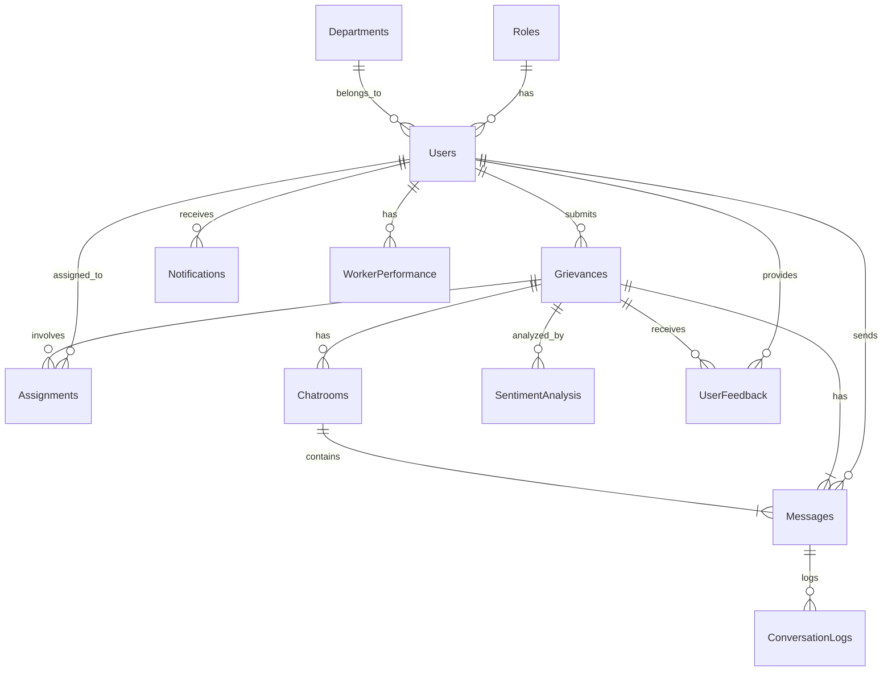

# Schema for Hostel Grievance Redressal System

Below is an exhaustive list of the updated database schema for the **Hostel Grievance Redressal System**, incorporating the necessary changes to accommodate user roles, simplify routing without skills, and streamline grievance management. The schema is designed to facilitate user management, grievance handling, real-time communication, multilingual support, and system administration without the previously included AI/ML functionalities.

## Table of Contents

1. [Users](#users)
2. [Roles](#roles)
3. [Departments](#departments)
4. [Grievances](#grievances)
5. [Assignments](#assignments)
6. [Chatrooms](#chatrooms)
7. [Messages](#messages)
8. [Sentiment Analysis](#sentiment-analysis)
9. [Conversation Logs](#conversation-logs)
10. [Notifications](#notifications)
11. [User Feedback](#user-feedback)
12. [Worker Performance](#worker-performance)

---

## Users

Stores information about all users within the system, including students, workers, and administrators.

| **Field**             | **Data Type**         | **Constraints**                          | **Description**                                   |
|-----------------------|-----------------------|------------------------------------------|---------------------------------------------------|
| `user_id`             | UUID                  | Primary Key, Default: UUID_GENERATE()    | Unique identifier for each user                   |
| `username`            | VARCHAR(50)           | Unique, Not Null                         | Username for login                                |
| `password_hash`       | VARCHAR(255)          | Not Null                                 | Hashed password for authentication                |
| `email`               | VARCHAR(100)          | Unique, Not Null                         | User's email address                              |
| `full_name`           | VARCHAR(100)          | Not Null                                 | User's full name                                  |
| `phone_number`        | VARCHAR(15)           | Nullable                                 | User's contact number                             |
| `role_id`             | UUID                  | Foreign Key → `Roles.role_id`, Not Null  | Role assigned to the user (e.g., Student, Worker, Admin) |
| `department_id`      | UUID                  | Foreign Key → `Departments.department_id`| Department the user belongs to (applicable for Workers) |
| `language_preference` | VARCHAR(20)           | Default: 'English'                       | Preferred language for communication             |
| `roll_number`         | VARCHAR(20)           | Nullable                                 | Roll number for students                           |
| `hostel_number`       | VARCHAR(20)           | Nullable                                 | Hostel number for students and admins             |
| `room_number`         | VARCHAR(20)           | Nullable                                 | Room number for students                           |
| `floor_number`        | INTEGER               | Nullable                                 | Floor number for students                          |
| `created_at`          | TIMESTAMP             | Default: CURRENT_TIMESTAMP               | Timestamp of account creation                     |
| `updated_at`          | TIMESTAMP             | Default: CURRENT_TIMESTAMP, On Update: CURRENT_TIMESTAMP | Timestamp of last update          |
| `is_active`           | BOOLEAN               | Default: TRUE                            | Indicates if the user account is active           |
| `available_time_slot` | VARCHAR(50)           | Nullable                                 | Time slot when the user is available              |

---
    
## Roles

Defines different user roles within the system.

| **Field**      | **Data Type** | **Constraints**                       | **Description**                     |
|----------------|---------------|---------------------------------------|-------------------------------------|
| `role_id`      | UUID          | Primary Key, Default: UUID_GENERATE() | Unique identifier for each role     |
| `role_name`    | VARCHAR(50)   | Unique, Not Null                      | Name of the role (e.g., Student, Worker, Admin) |
| `description`  | TEXT          | Nullable                              | Description of the role             |

---

## Departments

Represents various departments within the hostel that handle grievances.

| **Field**          | **Data Type** | **Constraints**                       | **Description**                     |
|--------------------|---------------|---------------------------------------|-------------------------------------|
| `department_id`    | UUID          | Primary Key, Default: UUID_GENERATE() | Unique identifier for each department |
| `department_name`  | VARCHAR(100)  | Unique, Not Null                      | Name of the department (e.g., Maintenance, Electrical, Plumbing) |
| `description`      | TEXT          | Nullable                              | Description of the department       |
| `created_at`       | TIMESTAMP     | Default: CURRENT_TIMESTAMP            | Timestamp of department creation    |
| `updated_at`       | TIMESTAMP     | Default: CURRENT_TIMESTAMP, On Update: CURRENT_TIMESTAMP | Timestamp of last update          |

---

## Grievances

Stores all grievances submitted by residents.

| **Field**              | **Data Type** | **Constraints**                                           | **Description**                                             |
|------------------------|---------------|-----------------------------------------------------------|-------------------------------------------------------------|
| `grievance_id`         | UUID          | Primary Key, Default: UUID_GENERATE()                     | Unique identifier for each grievance                        |
| `user_id`              | UUID          | Foreign Key → `Users.user_id`, Not Null                   | Identifier of the resident who submitted the grievance      |
| `category`             | VARCHAR(100)  | Not Null                                                   | Category of the grievance (e.g., Electrical, Plumbing)      |
| `title`                | VARCHAR(255)  | Not Null                                                  | Brief title of the grievance                                |
| `description`          | TEXT          | Not Null                                                  | Detailed description of the grievance                      |
| `submission_timestamp` | TIMESTAMP     | Default: CURRENT_TIMESTAMP                                | Timestamp when the grievance was submitted                 |
| `urgency_level`        | VARCHAR(20)   | Not Null, Check: ('Low', 'Medium', 'High', 'Critical')    | Urgency level of the grievance                             |
| `status`               | VARCHAR(50)   | Not Null                                                   | Current status of the grievance (e.g., Submitted, In Progress, Resolved, Closed) |
| `voice_input_url`      | VARCHAR(255)  | Nullable                                                  | URL to the voice input file (if submitted via voice)       |
| `language_detected`    | VARCHAR(20)   | Default: 'English'                                        | Language of the submitted grievance                        |
| `items_used`           | TEXT[]        | Nullable                                                  | Array of items used in the repair or for sorting grievances |
| `created_at`           | TIMESTAMP     | Default: CURRENT_TIMESTAMP                                | Timestamp of grievance record creation                     |
| `updated_at`           | TIMESTAMP     | Default: CURRENT_TIMESTAMP, On Update: CURRENT_TIMESTAMP | Timestamp of last update                                   |

---

## Assignments

Tracks the assignment of grievances to staff members.

```sql:database/assignments.sql
-- assignments.sql
CREATE TABLE Assignments (
    assignment_id UUID PRIMARY KEY DEFAULT uuid_generate_v4(),
    grievance_id UUID NOT NULL REFERENCES Grievances(grievance_id) ON DELETE CASCADE,
    staff_id UUID NOT NULL REFERENCES Users(user_id) ON DELETE SET NULL,
    assigned_at TIMESTAMP DEFAULT CURRENT_TIMESTAMP,
    expected_resolution_time VARCHAR(50),
    actual_resolution_time VARCHAR(50),
    status VARCHAR(50) DEFAULT 'Assigned', -- e.g., Assigned, In Progress, Completed
    created_at TIMESTAMP DEFAULT CURRENT_TIMESTAMP,
    updated_at TIMESTAMP DEFAULT CURRENT_TIMESTAMP
);
```

**Fields:**

| **Field**               | **Data Type** | **Constraints**                                           | **Description**                                              |
|-------------------------|---------------|-----------------------------------------------------------|--------------------------------------------------------------|
| `assignment_id`         | UUID          | Primary Key, Default: UUID_GENERATE()                     | Unique identifier for each assignment                        |
| `grievance_id`          | UUID          | Foreign Key → `Grievances.grievance_id`, Not Null         | Identifier of the assigned grievance                         |
| `staff_id`              | UUID          | Foreign Key → `Users.user_id`, Not Null                   | Identifier of the staff member assigned to the grievance     |
| `assigned_at`           | TIMESTAMP     | Default: CURRENT_TIMESTAMP                                | Timestamp when the grievance was assigned                     |
| `expected_resolution_time`| VARCHAR(50) | Nullable                                                  | Estimated time to resolve the grievance                       |
| `actual_resolution_time` | VARCHAR(50) | Nullable                                                  | Actual time taken to resolve the grievance                     |
| `status`                | VARCHAR(50)   | Default: 'Assigned'                                       | Current status of the assignment (e.g., Assigned, In Progress, Completed) |
| `created_at`            | TIMESTAMP     | Default: CURRENT_TIMESTAMP                                | Timestamp of assignment record creation                        |
| `updated_at`            | TIMESTAMP     | Default: CURRENT_TIMESTAMP, On Update: CURRENT_TIMESTAMP | Timestamp of last update                                       |

---

## Chatrooms

Represents dedicated chatrooms for each grievance to facilitate communication between students and workers/administrators.

```sql:database/chatrooms.sql
-- chatrooms.sql
CREATE TABLE Chatrooms (
    chatroom_id UUID PRIMARY KEY DEFAULT uuid_generate_v4(),
    grievance_id UUID NOT NULL REFERENCES Grievances(grievance_id) ON DELETE CASCADE,
    student_id UUID NOT NULL REFERENCES Users(user_id) ON DELETE CASCADE,
    worker_id UUID REFERENCES Users(user_id) ON DELETE SET NULL,
    message_ids UUID[] REFERENCES Messages(message_id),
    created_at TIMESTAMP DEFAULT CURRENT_TIMESTAMP,
    updated_at TIMESTAMP DEFAULT CURRENT_TIMESTAMP
);
```

**Fields:**

| **Field**      | **Data Type** | **Constraints**                                       | **Description**                                   |
|----------------|---------------|-------------------------------------------------------|---------------------------------------------------|
| `chatroom_id`  | UUID          | Primary Key, Default: UUID_GENERATE()                 | Unique identifier for each chatroom               |
| `grievance_id` | UUID          | Foreign Key → `Grievances.grievance_id`, Not Null     | Identifier of the associated grievance            |
| `student_id`   | UUID          | Foreign Key → `Users.user_id`, Not Null               | Identifier of the student involved                 |
| `worker_id`    | UUID          | Foreign Key → `Users.user_id`, Nullable                | Identifier of the worker assigned (if any)         |
| `message_ids`  | UUID[]        | References `Messages.message_id`                       | Array of message identifiers within the chatroom   |
| `created_at`   | TIMESTAMP     | Default: CURRENT_TIMESTAMP                            | Timestamp when the chatroom was created           |
| `updated_at`   | TIMESTAMP     | Default: CURRENT_TIMESTAMP, On Update: CURRENT_TIMESTAMP | Timestamp of last update                         |

---

## Messages

Stores all messages exchanged within chatrooms.

```sql:database/messages.sql
-- messages.sql
CREATE TABLE Messages (
    message_id UUID PRIMARY KEY DEFAULT uuid_generate_v4(),
    chatroom_id UUID NOT NULL REFERENCES Chatrooms(chatroom_id) ON DELETE CASCADE,
    sender_id UUID NOT NULL REFERENCES Users(user_id) ON DELETE SET NULL,
    message_content TEXT NOT NULL,
    translated_content TEXT,
    language VARCHAR(20) DEFAULT 'English',
    created_at TIMESTAMP DEFAULT CURRENT_TIMESTAMP,
    updated_at TIMESTAMP DEFAULT CURRENT_TIMESTAMP
);
```

**Fields:**

| **Field**           | **Data Type** | **Constraints**                                               | **Description**                                        |
|---------------------|---------------|---------------------------------------------------------------|--------------------------------------------------------|
| `message_id`        | UUID          | Primary Key, Default: UUID_GENERATE()                         | Unique identifier for each message                     |
| `chatroom_id`       | UUID          | Foreign Key → `Chatrooms.chatroom_id`, Not Null               | Identifier of the chatroom where the message was sent  |
| `sender_id`         | UUID          | Foreign Key → `Users.user_id`, Not Null                       | Identifier of the user who sent the message            |
| `message_content`   | TEXT          | Not Null                                                      | Original content of the message                        |
| `translated_content`| TEXT          | Nullable                                                      | Translated content of the message                      |
| `language`          | VARCHAR(20)   | Default: 'English'                                            | Language in which the message was sent                 |
| `created_at`        | TIMESTAMP     | Default: CURRENT_TIMESTAMP                                    | Timestamp when the message was sent                    |
| `updated_at`        | TIMESTAMP     | Default: CURRENT_TIMESTAMP, On Update: CURRENT_TIMESTAMP       | Timestamp of last update                                |

---

## Sentiment Analysis

Stores the results of sentiment and emotional analysis performed on grievances.

| **Field**               | **Data Type** | **Constraints**                                            | **Description**                                  |
|-------------------------|---------------|------------------------------------------------------------|--------------------------------------------------|
| `sentiment_id`          | UUID          | Primary Key, Default: UUID_GENERATE()                      | Unique identifier for each sentiment analysis     |
| `grievance_id`          | UUID          | Foreign Key → `Grievances.grievance_id`, Not Null          | Identifier of the associated grievance            |
| `sentiment_score`       | DECIMAL(5,2)  | Not Null                                                   | Overall sentiment score (e.g., -1.00 to 1.00)     |
| `emotion`               | VARCHAR(50)   | Not Null                                                   | Detected primary emotion (e.g., Anger, Frustration)|
| `confidence_score`      | DECIMAL(5,2)  | Not Null                                                   | Confidence level of the sentiment analysis        |
| `analyzed_at`           | TIMESTAMP     | Default: CURRENT_TIMESTAMP                                 | Timestamp when the analysis was performed          |
| `created_at`            | TIMESTAMP     | Default: CURRENT_TIMESTAMP                                 | Timestamp of record creation                       |
| `updated_at`            | TIMESTAMP     | Default: CURRENT_TIMESTAMP, On Update: CURRENT_TIMESTAMP    | Timestamp of last update                           |

---

## Conversation Logs

Stores logs of conversations handled by the context-aware chatbots for initial grievance handling.

```sql:database/conversation_logs.sql
-- conversation_logs.sql
CREATE TABLE ConversationLogs (
    conversation_id UUID PRIMARY KEY DEFAULT uuid_generate_v4(),
    user_id UUID NOT NULL REFERENCES Users(user_id) ON DELETE CASCADE,
    message_id UUID REFERENCES Messages(message_id) ON DELETE SET NULL,
    timestamp TIMESTAMP DEFAULT CURRENT_TIMESTAMP,
    intent VARCHAR(100),
    entities JSONB,
    bot_response TEXT,
    created_at TIMESTAMP DEFAULT CURRENT_TIMESTAMP,
    updated_at TIMESTAMP DEFAULT CURRENT_TIMESTAMP
);
```

**Fields:**

| **Field**     | **Data Type** | **Constraints**                                         | **Description**                                       |
|---------------|---------------|---------------------------------------------------------|-------------------------------------------------------|
| `conversation_id` | UUID      | Primary Key, Default: UUID_GENERATE()                   | Unique identifier for each conversation log           |
| `user_id`         | UUID      | Foreign Key → `Users.user_id`, Not Null                 | Identifier of the user involved in the conversation   |
| `message_id`      | UUID      | Foreign Key → `Messages.message_id`, Nullable            | Identifier of the message associated with the log     |
| `timestamp`       | TIMESTAMP | Default: CURRENT_TIMESTAMP                               | Timestamp of the message                               |
| `intent`          | VARCHAR(100)| Nullable                                                | Detected intent of the user's message                 |
| `entities`        | JSONB     | Nullable                                                | Extracted entities from the user's message            |
| `bot_response`    | TEXT      | Nullable                                                | Response generated by the chatbot                     |
| `created_at`      | TIMESTAMP | Default: CURRENT_TIMESTAMP                               | Timestamp of record creation                           |
| `updated_at`      | TIMESTAMP | Default: CURRENT_TIMESTAMP, On Update: CURRENT_TIMESTAMP | Timestamp of last update                             |

---

## Notifications

Manages notification settings and logs for users.

| **Field**            | **Data Type** | **Constraints**                                           | **Description**                                     |
|----------------------|---------------|-----------------------------------------------------------|-----------------------------------------------------|
| `notification_id`    | UUID          | Primary Key, Default: UUID_GENERATE()                     | Unique identifier for each notification               |
| `user_id`            | UUID          | Foreign Key → `Users.user_id`, Not Null                   | Identifier of the user receiving the notification     |
| `notification_type`  | VARCHAR(50)   | Not Null, Check: ('Email', 'SMS', 'In-App')               | Type of notification                                 |
| `content`            | TEXT          | Not Null                                                   | Content of the notification                          |
| `is_read`            | BOOLEAN       | Default: FALSE                                             | Indicates if the notification has been read           |
| `sent_at`            | TIMESTAMP     | Default: CURRENT_TIMESTAMP                                | Timestamp when the notification was sent             |
| `created_at`         | TIMESTAMP     | Default: CURRENT_TIMESTAMP                                | Timestamp of record creation                          |
| `updated_at`         | TIMESTAMP     | Default: CURRENT_TIMESTAMP, On Update: CURRENT_TIMESTAMP   | Timestamp of last update                              |

---

## User Feedback

Stores feedback provided by users regarding their grievance experience and the performance of the assigned workers.

```sql:database/user_feedback.sql
-- user_feedback.sql
CREATE TABLE UserFeedback (
    feedback_id UUID PRIMARY KEY DEFAULT uuid_generate_v4(),
    grievance_id UUID NOT NULL REFERENCES Grievances(grievance_id) ON DELETE CASCADE,
    user_id UUID NOT NULL REFERENCES Users(user_id) ON DELETE CASCADE,
    staff_id UUID REFERENCES Users(user_id) ON DELETE SET NULL,
    rating INTEGER NOT NULL CHECK (rating >= 1 AND rating <= 5),
    comments TEXT,
    submitted_at TIMESTAMP DEFAULT CURRENT_TIMESTAMP,
    created_at TIMESTAMP DEFAULT CURRENT_TIMESTAMP,
    updated_at TIMESTAMP DEFAULT CURRENT_TIMESTAMP
);
```

**Fields:**

| **Field**     | **Data Type** | **Constraints**                                           | **Description**                                  |
|---------------|---------------|-----------------------------------------------------------|--------------------------------------------------|
| `feedback_id` | UUID          | Primary Key, Default: UUID_GENERATE()                     | Unique identifier for each feedback entry        |
| `grievance_id`| UUID          | Foreign Key → `Grievances.grievance_id`, Not Null         | Identifier of the associated grievance           |
| `user_id`     | UUID          | Foreign Key → `Users.user_id`, Not Null                   | Identifier of the user providing the feedback    |
| `staff_id`    | UUID          | Foreign Key → `Users.user_id`, Nullable                    | Identifier of the staff assigned to the grievance|
| `rating`      | INTEGER       | Not Null, Check: (rating >= 1 AND rating <= 5)             | Rating provided by the user (1 to 5)             |
| `comments`    | TEXT          | Nullable                                                   | Additional comments provided by the user          |
| `submitted_at`| TIMESTAMP     | Default: CURRENT_TIMESTAMP                                 | Timestamp when the feedback was submitted         |
| `created_at`  | TIMESTAMP     | Default: CURRENT_TIMESTAMP                                 | Timestamp of feedback record creation             |
| `updated_at`  | TIMESTAMP     | Default: CURRENT_TIMESTAMP, On Update: CURRENT_TIMESTAMP   | Timestamp of last update                          |

---

## Worker Performance

Aggregates performance metrics of workers based on assignments and user feedback.

```sql:database/worker_performance.sql
-- worker_performance.sql
CREATE TABLE WorkerPerformance (
    performance_id UUID PRIMARY KEY DEFAULT uuid_generate_v4(),
    staff_id UUID NOT NULL REFERENCES Users(user_id) ON DELETE CASCADE,
    total_assignments INTEGER NOT NULL DEFAULT 0,
    completed_assignments INTEGER NOT NULL DEFAULT 0,
    average_rating DECIMAL(3,2) NOT NULL DEFAULT 0.00,
    performance_score DECIMAL(5,2) NOT NULL DEFAULT 0.00,
    evaluated_at TIMESTAMP DEFAULT CURRENT_TIMESTAMP,
    created_at TIMESTAMP DEFAULT CURRENT_TIMESTAMP,
    updated_at TIMESTAMP DEFAULT CURRENT_TIMESTAMP
);
```

**Fields:**

| **Field**               | **Data Type** | **Constraints**                                           | **Description**                                      |
|-------------------------|---------------|-----------------------------------------------------------|------------------------------------------------------|
| `performance_id`        | UUID          | Primary Key, Default: UUID_GENERATE()                     | Unique identifier for each performance record        |
| `staff_id`              | UUID          | Foreign Key → `Users.user_id`, Not Null                   | Identifier of the staff member                       |
| `total_assignments`     | INTEGER       | Not Null, Default: 0                                      | Total number of assignments handled                  |
| `completed_assignments` | INTEGER       | Not Null, Default: 0                                      | Number of assignments completed                      |
| `average_rating`        | DECIMAL(3,2)  | Not Null, Default: 0.00                                   | Average rating from user feedback                    |
| `performance_score`     | DECIMAL(5,2)  | Not Null, Default: 0.00                                   | Calculated performance score based on metrics        |
| `evaluated_at`          | TIMESTAMP     | Default: CURRENT_TIMESTAMP                                | Timestamp when the performance was evaluated         |
| `created_at`            | TIMESTAMP     | Default: CURRENT_TIMESTAMP                                | Timestamp of performance record creation             |
| `updated_at`            | TIMESTAMP     | Default: CURRENT_TIMESTAMP, On Update: CURRENT_TIMESTAMP  | Timestamp of last update                              |

---

## Entity-Relationship Diagram (ERD)

Below is a simplified representation of the relationships between the main entities:



---


